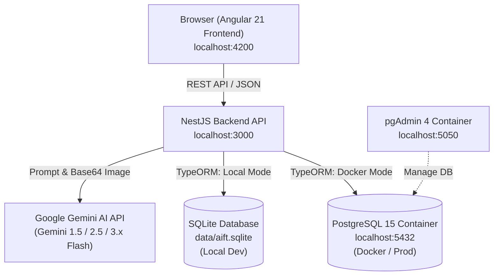

# 📋 AI Finance Tracker (AIFT) - Project Handoff & Developer Guide

> **คู่มือส่งมอบงานและเริ่มต้นพัฒนาโปรเจกต์ (Developer Handoff)**  
> รวบรวมข้อมูลทุกอย่างสำหรับการย้ายเครื่อง ติดตั้งใหม่ หรือส่งต่อให้ทีมพัฒนาคนอื่นสามารถเริ่มงานต่อได้ทันทีภายใน 2-3 นาที

---

## ⚡ 1. สรุปวิธีรันโปรเจกต์ด่วน (Quick Start)

เลือกรันได้ 2 รูปแบบตามความสะดวก:

```
┌────────────────────────────────────────────────────────────────────────┐
│  แบบที่ 1 (แนะนำสำหรับ Dev ไวสุด): Local Dev + SQLite (ไม่ต้องเปิด Docker) │
│  แบบที่ 2 (สำหรับเทส Production): Docker Compose + PostgreSQL + pgAdmin │
└────────────────────────────────────────────────────────────────────────┘
```

### แบบที่ 1: Local Dev Mode (เร็วที่สุด ~ 1 นาที 🚀)
ไม่ต้องติดตั้งหรือรันฐานข้อมูลใดๆ เพราะระบบจะสลับไปใช้ **SQLite (`data/aift.sqlite`)** ให้โดยอัตโนมัติ

1. **เตรียมไฟล์ Environment:**
   สร้างไฟล์ `aift-backend/.env` (ดูค่าตัวอย่างในหัวข้อที่ 3):
   ```env
   GEMINI_API_KEY=your_gemini_api_key_here
   ```
2. **รัน Backend:**
   ```bash
   cd aift-backend
   npm install
   npm run start:dev
   ```
   *(API จะพร้อมทำงานที่ `http://localhost:3000`)*

3. **รัน Frontend:** (เปิดอีก Terminal)
   ```bash
   cd aift-frontend
   npm install
   npm start
   ```
   *(เข้าใช้งานผ่านเว็บเบราว์เซอร์ที่ `http://localhost:4200`)*

---

### แบบที่ 2: Docker Mode (Full Stack + PostgreSQL 🐘)
สำหรับทดสอบระบบเสมือน Production ด้วย PostgreSQL และเครื่องมือจัดการ pgAdmin

```bash
cd aift-backend/Docker
docker compose up -d --build
```
- **Backend API:** `http://localhost:3000`
- **PostgreSQL:** `localhost:5432` (User: `postgres`, Pass: `postgres`, DB: `aift`)
- **pgAdmin 4 Web UI:** `http://localhost:5050`
  - *Login:* `admin@aift.com` / `admin`
- **Frontend:** รัน `cd aift-frontend && npm start` แล้วเข้า `http://localhost:4200`

---

## 🏗️ 2. ภาพรวมสถาปัตยกรรม (System Architecture)



### Tech Stack Breakdown
| ส่วนงาน | เทคโนโลยี | รายละเอียดสำคัญ |
|---|---|---|
| **Frontend** | **Angular 21** | Standalone Components, Signals, Reactive Form, ng2-charts (Chart.js), Modern CSS |
| **Backend** | **NestJS 11** | TypeScript, Express platform, TypeORM, `@google/generative-ai` & `@google/genai` |
| **Database** | **Dual Engine** | **SQLite** (`better-sqlite3`) สำหรับ local dev + **PostgreSQL 15** สำหรับ Docker/Production |
| **AI Engine** | **Gemini API** | ทำงานผ่าน Waterfall fallback (3.5 Flash-Lite → 3.6 Flash → 3.1 Flash-Lite → 2.5 Flash-Lite) |
| **DevOps** | **Docker** | Multi-container compose (Backend + Postgres 15 + pgAdmin 4) |

---

## 🔑 3. การตั้งค่า Environment Variables (`.env`)

ไฟล์คอนฟิกอยู่ที่: `aift-backend/.env`

```env
# Database Settings (สำหรับต่อ PostgreSQL หรือ Docker)
DB_TYPE=sqlite            # ใส่ 'sqlite' (สำหรับ dev) หรือ 'postgres' (สำหรับ docker/prod)
DB_HOST=localhost         # ใน Docker จะถูก override อัตโนมัติเป็น 'postgres'
DB_PORT=5432
DB_USER=postgres
DB_PASS=postgres
DB_NAME=aift

# Google Gemini API Key (จำเป็นสำหรับฟังก์ชัน AI)
GEMINI_API_KEY=AIzaSyxxxxxxxxxxxxxxxxxxxxxxxxxxxxxxx
```

> **การขอ Gemini API Key:** สามารถเข้าไปสร้างได้ฟรีที่ [Google AI Studio](https://aistudio.google.com/) แล้วนำ API Key มาใส่ในตัวแปร `GEMINI_API_KEY`

---

## 💾 4. กลไก Dual Database (SQLite vs PostgreSQL)

ระบบถูกออกแบบให้สลับฐานข้อมูลอัตโนมัติใน `aift-backend/src/app.module.ts`:

1. **เมื่อรันใน Docker (`docker-compose.yml`):**
   - มีการ inject `DB_TYPE=postgres` และ `DB_HOST=postgres`
   - เชื่อมต่อไปยัง container PostgreSQL ผ่านเครือข่าย Docker
2. **เมื่อรัน Local ทั่วไป (`npm run start:dev`):**
   - หากไม่ได้ระบุ `DB_TYPE=postgres` ระบบจะใช้ `better-sqlite3` ชี้ไปที่ไฟล์ `data/aift.sqlite` ในเครื่องทันที
   - ไม่จำเป็นต้องเปิดโปรแกรม PostgreSQL ในเครื่อง

### โครงสร้าง Entities ทั้ง 5 ตาราง (Data Isolation per Account)
1. `User` (`users`): บัญชีผู้ใช้ (id, username, password, displayName, createdAt, updatedAt)
2. `Expense` (`expenses`): บันทึกรายจ่าย ผูกกับ `userId` (id, userId, item, amount, category, date, created_at)
3. `Income` (`incomes`): บันทึกรายรับ ผูกกับ `userId` (id, userId, source, amount, date, created_at)
4. `AiSummaryCache` (`ai_summary_cache`): แคชสรุปรายเดือนของ AI ผูกกับ `userId` (id, userId, year, month, summary, created_at)
5. `Budget` (`budgets`): งบประมาณรายหมวด ผูกกับ `userId` (id, userId, category, limit, created_at, updated_at) - Unique `[category, userId]`

---

## 🔐 5. ระบบสมาชิกและการแยกข้อมูลราย Account (Authentication & Isolation)

1. **Authentication Stack:**
   - ใช้ **Passport JWT** + **bcrypt** สำหรับการ Hash รหัสผ่านและ Sign Token (อายุ 30 วันสำหรับ Persistent Login)
   - ป้องกัน API ทั้งหมดด้วย `JwtAuthGuard` ดึงผู้ใช้ผ่าน `@CurrentUser()`
2. **Data Isolation (100%):**
   - ทุกคำสั่ง Query (ค้นหา, สร้าง, แก้ไข, ลบ) ถูก Scope ด้วย `userId` ของผู้ใช้ที่กำลังล็อกอินอยู่เท่านั้น
   - ผู้ใช้แต่ละคนจะไม่สามารถมองเห็น หรือแก้ไขข้อมูลของคนอื่นได้โดยเด็ดขาด
3. **Frontend Integration:**
   - `AuthService` จัดการ State ด้วย Angular Signals และเก็บ JWT Token ใน `localStorage`
   - `authInterceptor` แนบ Header `Authorization: Bearer <token>` อัตโนมัติในทุกคำขอ API
   - `authGuard` ป้องกันหน้า Dashboard และ Budgets หากยังไม่ล็อกอินจะ redirect ไปที่ `/login`

---

## 🤖 6. การทำงานของระบบ AI (Gemini AI Services)

โค้ดหลักอยู่ที่ `aift-backend/src/ai/ai.service.ts`:

1. **Chat Input Parsing (`POST /expenses/chat`, `POST /income/chat`):**
   - แปลงข้อความภาษาพูดธรรมชาติ (เช่น *"กินข้าวเที่ยงไป 65 บาท"*) ให้กลายเป็น JSON โครงสร้าง `{ item, amount, category }`
2. **Receipt Image Recognition (`POST /expenses/receipt`):**
   - รับรูปถ่ายใบเสร็จในรูปแบบ base64 (รองรับรูปขนาดใหญ่ ขยาย body limit ไว้ 15MB)
   - AI สกัดชื่อร้าน, ราคารวม, และจัดหมวดหมู่อัตโนมัติ
3. **Monthly AI Summary & Cache (`GET /expenses/ai-summary`):**
   - คำนวณสรุปพฤติกรรมการใช้จ่ายรายเดือน เปรียบเทียบกับเดือนก่อนหน้า และให้คำแนะนำ (คำนวณแยกเฉพาะราย Account)
   - มีระบบ Cache ในตาราง `ai_summary_cache` ต่อผู้ใช้และต่อเดือน
4. **Resilient Model Fallback Waterfall:**
   - หากโมเดลใดโมเดลหนึ่งโควตาเต็มหรือขัดข้อง ระบบจะ fallback เรียงตามลำดับความเร็วและความประหยัด พร้อม fallback สำเร็จรูปภาษาไทย

---

## 💰 7. ตรรกะระบบจัดการงบประมาณ (Budgets Engine)

โค้ดหลักอยู่ที่ `aift-backend/src/budgets/budgets.service.ts`:

1. **งบแนะนำจากพฤติกรรมจริง (`GET /budgets/recommendations`):**
   - คำนวณจากค่าเฉลี่ยการใช้จ่ายจริงย้อนหลัง 3 เดือนล่าสุดในแต่ละหมวดของ Account นั้นๆ
   - นำค่าเฉลี่ยมาปัดเศษขึ้นเป็นเลขกลมๆ (ปัดขึ้นหลัก 50 บาท เช่น 210 -> 250)
2. **การติดตามสถานะ (`GET /budgets/status?year=&month=`):**
   - `ok`: ใช้น้อยกว่า 80% (หลอดสีเขียว)
   - `warning`: ใช้ระหว่าง 80% - 100% (หลอดสีเหลือง แจ้งเตือนใกล้เกินงบ)
   - `exceeded`: ใช้เกิน 100% (หลอดสีแดง แจ้งเตือนเกินงบ)

---

## 📡 8. สรุป Endpoint สำคัญ (API Reference)

> **หมายเหตุ:** ทุก Endpoint (ยกเว้น `/auth/register` และ `/auth/login`) จำเป็นต้องแนบ Header `Authorization: Bearer <token>`

### หมวดสมาชิกและการเข้าสู่ระบบ (Authentication)
- `POST /auth/register` : สมัครสมาชิกใหม่ `{ username, password, displayName }`
- `POST /auth/login` : เข้าสู่ระบบ `{ username, password }` ได้รับ JWT token + user data
- `GET /auth/me` : ดึงข้อมูลโปรไฟล์ผู้ใช้งานปัจจุบัน

### หมวดรายจ่าย (Expenses)
- `POST /expenses/chat` : ส่งข้อความแชท ให้ AI แปลงและบันทึกรายจ่าย
- `POST /expenses/receipt` : อัปโหลดรูปใบเสร็จ base64 ให้ AI อ่านและบันทึก
- `GET /expenses/daily?date=YYYY-MM-DD` : รายการรายจ่ายของวันที่เลือก
- `GET /expenses/summary?year=YYYY&month=MM` : ผลรวมและสัดส่วนกราฟวงกลมรายเดือน
- `GET /expenses/ai-summary?year=YYYY&month=MM` : อ่านสรุป AI ประจำเดือนจาก Cache
- `POST /expenses/ai-summary/refresh?year=YYYY&month=MM` : บังคับให้ AI สรุปเดือนนั้นใหม่
- `PATCH /expenses/:id` : แก้ไขรายการรายจ่าย (item, amount, category)
- `DELETE /expenses/:id` : ลบรายการรายจ่าย

### หมวดรายรับ (Income)
- `POST /income/chat` : ส่งข้อความแชท ให้ AI แปลงและบันทึกรายรับ
- `POST /income` : บันทึกรายรับโดยตรง
- `GET /income/daily?date=YYYY-MM-DD` : รายการรายรับของวัน
- `GET /income/summary?year=YYYY&month=MM` : ยอดรวมรายรับประจำเดือน
- `PATCH /income/:id` : แก้ไขรายการรายรับ
- `DELETE /income/:id` : ลบรายการรายรับ

### หมวดงบประมาณ (Budgets)
- `GET /budgets` : รายการงบประมาณทุกหมวด
- `POST /budgets` : สร้างหรือแก้ไขงบประมาณรายหมวด (Upsert)
- `DELETE /budgets/:id` : ลบงบประมาณ
- `GET /budgets/recommendations` : คำนวณงบแนะนำจากสถิติย้อนหลัง 3 เดือน
- `GET /budgets/status?year=YYYY&month=MM` : ตรวจสอบสถานะการใช้งบเทียบกับรายจ่ายจริง

---

## ⚠️ 8. ปัญหาที่พบบ่อยและวิธีแก้ไข (Troubleshooting & Gotchas)

### 🔴 ปัญหาที่ 1: รันคำสั่ง npm บน Windows PowerShell ไม่ได้ (`PSSecurityException`)
**อาการ:** ขึ้นข้อความว่า `File C:\...\npm.ps1 cannot be loaded because running scripts is disabled on this system.`  
**วิธีแก้:**
1. ใช้ Command Prompt (`cmd`) แทน หรือ
2. รันคำสั่งนี้ใน PowerShell หนึ่งครั้งเพื่อปลดล็อก:
   ```powershell
   Set-ExecutionPolicy -Scope Process -ExecutionPolicy Bypass
   ```
   หรือรันผ่าน `npm.cmd` เช่น `npm.cmd run start:dev`

### 🔴 ปัญหาที่ 2: Backend ใน Docker ต่อ Database ไม่ได้ (`ECONNREFUSED 127.0.0.1:5432`)
**อาการ:** Container `aift-backend` พยายามต่อหา localhost แล้วเกิด Connection Refused  
**วิธีแก้:**
- ใน Docker network ตัว backend ต้องต่อหา service ด้วยชื่อ `postgres` (ไม่ใช่ `localhost`)
- ตรวจสอบว่าใน `Docker/docker-compose.yml` มีการกำหนด:
  ```yaml
  environment:
    - DB_TYPE=postgres
    - DB_HOST=postgres
  ```

### 🔴 ปัญหาที่ 3: Dockerfile error `npm error gyp ERR! find Python`
**อาการ:** Alpine Linux ไม่มี C/C++ compiler ในการคอมไพล์ `better-sqlite3`  
**วิธีแก้:**
- ใน `aift-backend/Docker/Dockerfile` ต้องมีคำสั่ง:
  ```dockerfile
  RUN apk add --no-cache python3 make g++
  ```
  *(ไฟล์ปัจจุบันได้รับการแก้ไขเรียบร้อยแล้ว)*

### 🔴 ปัญหาที่ 4: สแกนรูปใบเสร็จขนาดใหญ่แล้ว Error `413 Payload Too Large`
**วิธีแก้:**
- Backend ได้ปรับขนาด Express body limit เป็น `15mb` เรียบร้อยแล้วใน `main.ts`

---

## 📂 9. แผนผังโฟลเดอร์โปรเจกต์ (Folder Structure)

```text
AIFT/
├── aift-backend/               # NestJS API Backend
│   ├── data/                   # ที่เก็บไฟล์ฐานข้อมูล aift.sqlite
│   ├── Docker/                 # Dockerfile และ docker-compose.yml
│   │   ├── Dockerfile
│   │   └── docker-compose.yml
│   ├── src/
│   │   ├── ai/                 # Gemini API Integration & Waterfall logic
│   │   ├── budgets/            # จัดการงบประมาณรายหมวด & คำนวณแนะนำ
│   │   ├── expenses/           # รายจ่าย, กราฟ, ใบเสร็จ, AI cache
│   │   ├── income/             # รายรับ
│   │   ├── app.module.ts       # โมดูลหลัก (รองรับ Dynamic DB SQLite/Postgres)
│   │   └── main.ts             # Entry point (ขยาย body limit 15MB)
│   ├── .env                    # Environment variables (DB & Gemini API Key)
│   └── package.json
│
├── aift-frontend/              # Angular 21 Single Page Application
│   ├── src/
│   │   ├── app/
│   │   │   ├── components/     # UI Components (Chat, Charts, Daily log, etc.)
│   │   │   ├── services/       # Expense, Income, Budget API callers
│   │   │   ├── app.routes.ts   # เส้นทางหน้าเว็บ (/ และ /budgets)
│   │   │   └── app.component.* # โครงหลัก Nav bar + สลับ Dark/Light Theme
│   │   ├── styles.css
│   │   └── index.html
│   └── package.json
│
├── HANDOFF.md                  # เอกสาร Handoff ฉบับนี้
├── SYSTEM_OVERVIEW.md          # เอกสารสถาปัตยกรรมระบบละเอียด
└── PROJECT_OVERVIEW_PRODUCT.md # เอกสาร Product Vision & Roadmap
```

---

*จัดทำขึ้นเพื่อให้การสืบทอด พัฒนาต่อ และ Deploy ระบบ AI Finance Tracker เป็นไปได้อย่างราบรื่นและรวดเร็วที่สุด*
